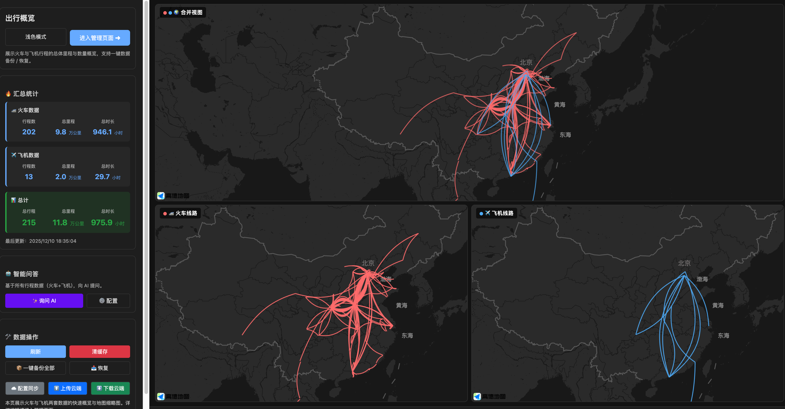
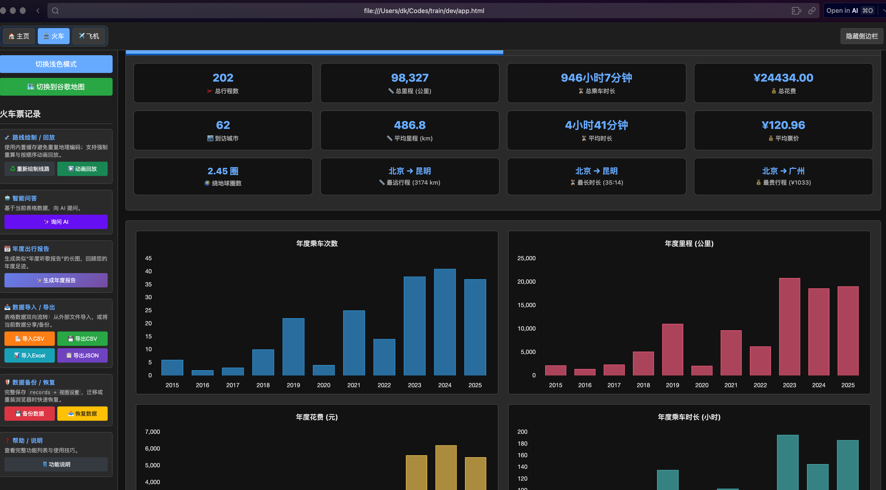
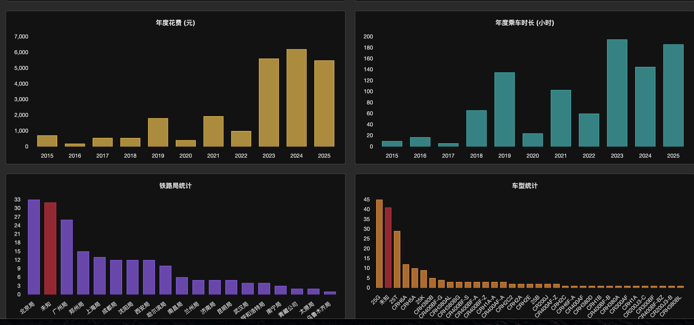
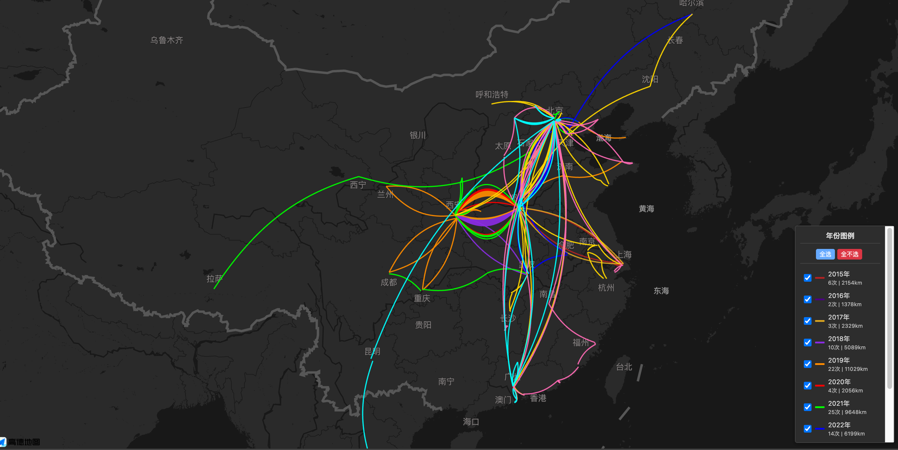

# 🚆✈️ Train & Flight Records Manager (v8.0.0)

一个功能强大的离线网页应用，用于记录、管理、可视化和分析您的火车和飞机出行历史。

## 🌐 在线演示

**演示地址**：https://doubleking-1.github.io/train-flight-records-manager/

⚠️ **使用说明**：
- 在线演示版本需要您自行配置 API Keys 才能使用完整功能
- 地图和 AI 功能需要相应的 API 密钥
- **推荐下载到本地使用**以获得最佳体验

💡 **快速体验**：
- 可以直接查看应用界面和设计
- 导入本地数据文件进行测试
- 完整功能配置请参考下方[快速开始](#快速开始)部分

## 📸 应用截图

### 主页 - 地图概览


### 管理页面 - 数据编辑


### 统计图表


### 地图可视化


## ✨ 主要特性

### 🎯 双模式独立管理
- **火车模式** 🚆：管理火车票记录（车次、铁路局、车型号等）
- **飞机模式** ✈️：管理机票记录（航班号、航空公司、机型等）
- 数据完全独立存储，模式切换不丢失

### 🗺️ 地图可视化
- **双地图支持**：高德地图（Gaode） / Google Maps 自由切换
- **智能路线绘制**：自动计算起终点坐标并绘制弧线
- **路径缓存**：避免重复地理编码请求，提升性能
- **路径重绘**：支持强制重新生成路径，产生不同曲线外观
- **年份图例**：右下角交互图例，可选择性显示/隐藏特定年份的路线

### 🎬 动画回放
- **混合回放**：支持 🚆 火车（红色） / ✈️ 飞机（蓝色） / 🌍 全部混合
- **多种模式**：
  - 全部年份一次性回放
  - 逐年顺序播放
  - 指定单个年份回放
- **实时里程**：动画过程中显示累计里程数

### 📊 数据管理
- **行内编辑**：直接在表格中编辑、插入、删除记录
- **多列排序**：点击表头排序（日期、时间、车次/航班号、站点、城市、费用、里程等）
- **自动计算**：
  - 速度 (km/h)：根据里程和时长自动计算
  - 单价 (RMB/km)：根据费用和里程自动计算
  - 两个字段均为只读，实时更新
- **导入/导出**：
  - CSV 导入：强大容错，自动识别"出发站"/"起点"等多种表头别名
  - Excel 导入：支持 `.xlsx` 格式
  - CSV/JSON 导出：包含完整数据和计算字段，表头自动适配中英文
- **备份/恢复**：一键创建完整快照（`.json`），包含记录、设置、路径缓存
- **云端同步** ☁️：通过 JSONBin 实现多设备数据同步

### 🤖 AI 智能分析
- **智能问答** ✨：向 AI 提问您的行程细节
  - 示例："我去过哪些城市？"、"最远的一次旅行是哪里？"、"2024年花费最多的是哪次？"
  - 自动读取所有记录作为上下文
- **灵活配置** ⚙️：支持多种 AI 提供商
  - 第三方 API（OpenAI 兼容）
  - Gemini 官方 API
  - API Key 仅本地存储，隐私安全
- **年度报告**：自动生成年度足迹报告，支持保存为图片

### 📈 统计与可视化
- **实时统计面板**：
  - 总次数、总里程、总花费、总时长
  - 最远路线、最长时长、最高花费
  - 平均速度、平均单价
- **多维图表**：
  - 年度/月度次数、里程、费用、时长柱状图
  - 铁路局/航空公司统计（未知值红色高亮）
  - 车型/机型分布统计
  - 路线热力图和城市访问排名
- **交互式统计**：点击汇总卡片自动高亮并滚动到对应表格行

### 🎨 界面与主题
- **暗色模式**：全站适配深色主题
- **响应式设计**：适配不同屏幕尺寸
- **功能说明**：内置详细功能帮助文档

## 📁 项目结构

```
dev/
├── index.html          # 主页 - 展示所有记录的地图概览和汇总统计
├── app.html            # 管理页 - 完整的数据编辑和分析界面
├── js/
│   ├── config.js       # API 配置（地图、AI 等）
│   ├── index.js        # 主页逻辑
│   ├── app.js          # 管理页核心逻辑
│   ├── cloud_sync.js   # 云端同步功能
│   └── features_help.js# 功能说明共享模块
├── css/
│   ├── index.css       # 主页样式
│   └── app.css         # 管理页样式
├── CHANGELOG.md        # 版本更新日志
└── README.md           # 项目说明文档
```

## 🚀 快速开始

### 1. 克隆或下载项目

```bash
git clone https://github.com/你的用户名/train-flight-records-manager.git
cd train-flight-records-manager
```

### 2. 配置 API Keys（必须）

#### 2.1 复制配置文件

```bash
cp js/config.example.js js/config.js
```

#### 2.2 编辑配置文件

打开 `js/config.js`，根据需要配置以下 API Keys：

##### 🗺️ 地图 API（至少配置一个）

**高德地图**（推荐国内用户）
1. 访问 [高德开放平台](https://lbs.amap.com/)
2. 注册账号并创建"Web端（JS API）"应用
3. 获取两个密钥：
   - **Key**：应用的 Key
   - **安全密钥**：在应用设置中的 "Web服务" 安全密钥
4. 在 `js/config.js` 中填入：
   ```javascript
   window._AMapSecurityConfig = {
     securityJsCode: '你的安全密钥',
   };
   
   amap: {
     key: '你的高德地图Key',
     // ...
   }
   ```

**Google Maps**（推荐国外用户）
1. 访问 [Google Cloud Console](https://console.cloud.google.com/)
2. 创建项目并启用 "Maps JavaScript API"
3. 创建 API 凭据（API Key）
4. 在 `js/config.js` 中填入：
   ```javascript
   google: {
     key: '你的Google Maps Key',
     // ...
   }
   ```

##### 🤖 AI API（可选，用于智能问答功能）

**选项 1：Gemini 官方**
1. 访问 [Google AI Studio](https://makersuite.google.com/app/apikey)
2. 创建 API Key
3. 在应用界面的"AI 配置"中选择 "Gemini 官方"并填入 Key

**选项 2：第三方 OpenAI 兼容 API**
1. 根据你的服务提供商（如 ChatAnywhere）获取 API Key
2. 在应用界面的"AI 配置"中选择 "第三方 AI"并填入配置

⚠️ **注意**：AI 功能是可选的，不配置也可以正常使用其他所有功能。

##### ☁️ 云端同步（可选）

1. 访问 [JSONBin.io](https://jsonbin.io/)
2. 注册并获取 Master Key
3. 在应用界面的"云端同步配置"中填入

### 3. 打开应用

直接在浏览器中打开文件：
- **主页概览**：`index.html`
- **数据管理**：`app.html`

或使用本地服务器（推荐）：

```bash
# 使用 Python
python -m http.server 8000

# 使用 Node.js
npx serve

# 使用 VS Code Live Server 插件
# 在 VS Code 中右键点击 HTML 文件 -> "Open with Live Server"
```

然后访问 `http://localhost:8000`

### 4. 开始使用

#### 首次使用
1. 打开 `app.html`
2. 选择模式（� 火车 或 ✈️ 飞机）
3. 点击 "➕ 新增" 添加第一条记录
4. 填写出行信息并保存

#### 导入已有数据
1. 点击 "导入" 按钮
2. 选择 CSV 或 Excel 文件
3. 系统会自动识别表头并导入数据

#### 查看地图和统计
1. 添加记录后，地图会自动显示路线
2. 切换到 "统计" 标签查看图表
3. 使用 "动画回放" 功能查看行程动画

## ⚙️ 配置说明

### API 配置文件：`js/config.js`

包含以下配置：
- 高德地图 API Key 和版本
- Google Maps API Key 和配置
- AI 服务端点和模型
- 第三方库 CDN（Chart.js、XLSX.js、Marked.js）

### 本地存储

应用使用 `localStorage` 存储：
- `trainRecords`：火车票记录
- `planeRecords`：机票记录
- `geocodeCache`：地理编码缓存
- 用户设置和偏好

## 📝 使用技巧

1. **快速修改记录**：双击表格行进入编辑模式
2. **路径调整**：如果路线显示不理想，使用"🔄 重新画线"功能
3. **年份筛选**：在统计面板选择特定年份，表格和地图会自动过滤
4. **导出数据**：定期备份数据，导出 JSON 文件保存完整信息
5. **AI 问答**：使用自然语言提问，AI 会分析所有记录给出答案

## 🔒 隐私与安全

- ✅ **完全离线**：所有数据存储在本地浏览器
- ✅ **无服务器**：不依赖后端服务器
- ✅ **API Key 本地化**：所有 API 密钥仅存储在本地
- ✅ **云同步可选**：是否使用云端同步完全由您决定

## 🆕 最新更新 (v8.0.0)

- ✨ 新增自动计算的速度 (km/h) 列
- ✨ 扩展了表格排序功能，支持更多列
- ✨ 新增铁路局/航空公司统计图表
- ✨ 新增车型/机型分布图表
- ✨ 统计图表中未知值红色高亮
- ✨ 新增"重新画线"功能按钮
- 🐛 修复备注字段显示错误
- 🐛 修复统计卡片点击高亮功能

详见 [CHANGELOG.md](CHANGELOG.md)

## 💡 关于本项目

本项目完全借助 AI 辅助编写，代码、文档、功能设计均通过人机协作完成。这是一次有趣的探索，展示了 AI 在软件开发中的潜力。

项目仍在持续优化中，如有任何问题或建议，欢迎提出 Issue 或 PR。还请多多指教！🙏

## 📄 开源协议

本项目采用 MIT 协议开源。详见 [LICENSE](LICENSE) 文件。

## 🙏 致谢

感谢以下开源项目和服务：
- [高德地图 Web API](https://lbs.amap.com/)
- [Google Maps Platform](https://developers.google.com/maps)
- [Chart.js](https://www.chartjs.org/)
- [SheetJS (XLSX)](https://sheetjs.com/)
- [Marked.js](https://marked.js.org/)
- [JSONBin.io](https://jsonbin.io/)
